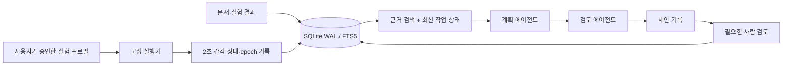

# CHUM 연구 하네스 운영 안내

작성: 2026-10-01. 현재 작업 상태는 `state/CHUM_WORK_STATE.json`, 실제 실험 진행 상태는 해당 output의 `LIVE_STATUS.json`을 확인한다.

## 목적과 구성

기존 CHUM 실험 로드맵을 실행하면서 근거 검색, 작업 계획, 검토, 실행 기록을 연결한다. 기존 `main.py`의 mock 주제 검토 워크플로는 유지하며 실제 운영은 `python -m harness`로 실행한다.



계획·검토 에이전트는 같은 로컬 소형 모델을 서로 다른 역할로 호출한다. 서로 독립적으로 학습된 모델의 합의가 아니다. 문서 검색은 SQLite FTS5와 한국어 부분문자열 검색이다. 현재 규모에서는 벡터 DB 없이 근거를 검색한다. chunk ID·문서 경로·해시를 함께 전달하며 모델 응답의 인용이 실제 제공된 ID인지 검사한다. 이 검사는 문장의 사실성이나 인용의 의미적 타당성을 보장하지 않는다.

## 로컬 모델

기존에 설치된 `qwen3.5:2b` 가중치에 CHUM 역할과 출력 설정을 적용한 `chum-ops:latest`를 사용한다. 정의는 `configs/CHUM_LOCAL_MODEL.Modelfile`에 있다. 새 기초 모델 학습이나 파인튜닝을 수행한 것은 아니다.

```powershell
# Thesis-Orchestrator에서
ollama create chum-ops:latest -f configs/CHUM_LOCAL_MODEL.Modelfile
$env:CHUM_LOCAL_MODEL = "chum-ops:latest"
python -m harness index
python -m harness ask "현재 완료 상태를 기준으로 다음 window 실험의 실행 순서와 주의점을 제안해줘"
```

Ollama가 실행 중이어야 한다. 환경변수를 생략하면 provider는 기존 `qwen3.5:2b`를 사용한다. 모든 요청은 로컬 loopback 주소로만 보내며 외부 API 키가 필요 없다. 추론 완료 후 `keep_alive=0`으로 GPU 메모리를 반환한다. 학습과 추론의 GPU 동시 사용은 피한다. `CHUM_LOCAL_NUM_GPU=0`은 CPU 추론 설정이며 속도는 별도 측정해야 한다.

실제 첫 시험에서는 JSON·인용 형식이 맞아도 오래된 문서 때문에 완료된 1A를 다시 추천했다. 최신 작업 상태를 검색 결과 앞에 명시한 뒤에는 1A 완료와 다음 1B를 올바르게 구분했다. 한 시나리오에서 계획 약 7.17초, 검토 약 6.33초, 전체 13.58초였다. 일반적 판단 정확도나 지연시간 보장은 아니다. 상세한 실패·개선 기록은 `outputs/chum_harness_20261001/LOCAL_MODEL_EVALUATION.json`을 참조한다.

Ollama 구현 근거: [Chat API](https://docs.ollama.com/api/chat), [Structured outputs](https://docs.ollama.com/capabilities/structured-outputs).

## 프로젝트 데이터로 실제 파인튜닝한 운영 모델

사용자 선택에 따라 기존 Qwen2.5-0.5B-Instruct에 LoRA와 분류 헤드를 실제 학습했다. Ollama 설정 변경과는 별도 모델이다. 494,582,400개 중 545,152개 파라미터를 학습했고, 3 epoch 후 약 2.18MB의 어댑터를 `outputs/harness/models/chum-ops-lora`에 저장했다. 베이스 모델 revision과 파일 해시는 `outputs/chum_ops_training_20261001/BASE_MODEL_MANIFEST.json`에 고정했다.

입력은 작업 기록이며 출력은 실패 조사, 진행 모니터링, 미완료 재개, 완료 결과 검토, 사람 검토 요청의 다섯 행동 중 하나다. 자유로운 연구 판단 전체를 학습한 모델은 아니다. 기존 기록과 실제 DB 사건에서 83개 예제를 만들고 train 43 / validation 18 / test 22로 run 단위 분리했다. 정답은 명시된 운영 규칙을 적용한 것으로, 사람이 확인한 정답이라고 표시하지 않았다. 과거 epoch로 만든 관측 표현은 DERIVED_FROM_REAL_ARTIFACT로 구분한다.

**운영 적용 기준은 실패했다.** validation은 100%였지만 새 run의 test는 9/22(40.9%)였다. 다수 클래스 기준선은 20/22, 상태 규칙은 22/22였다. 학습에 없었던 live_status_event 형식 13개를 모두 잘못 분류했다. 가장 긴 입력이 94 tokens여서 256-token 제한으로 잘린 문제는 아니었다. 따라서 모델은 선택적으로 시험하는 기능으로 남기며 자동 실행에 사용하지 않는다. softmax는 보정된 확률이 아니고, 모든 제안은 사람 검토 대상으로 표시한다.

CPU의 한 사례에서 최초 호출은 로드 포함 약 5.28초, 재호출은 0.425초였다. 일반적 지연시간이나 규칙 대비 효율 향상을 입증한 결과는 아니다. 평가와 실패 진단, 실제 추론 기록은 같은 폴더의 TRAINING_REPORT.json, V1_FAILURE_DIAGNOSIS.json, INFERENCE_DEMO.json을 참조한다.

```powershell
$trainPython = "$env:TEMP/cg/Scripts/python.exe"
& $trainPython -m pip install -r configs/requirements-chum-finetune.txt
& $trainPython experiments/download_chum_ops_base.py

# 어댑터를 실제로 읽어 CPU에서 예측하고 DB에 기록
& $trainPython -m harness route outputs/chum_ops_training_20261001/test.jsonl --row 0

# 선택적 검색 근거 추가. 이 입력 형식의 성능은 별도 검증 대상
& $trainPython -m harness route outputs/chum_ops_training_20261001/test.jsonl --row 9 --query "RUNNING stage training"
```

재학습기는 `experiments/finetune_chum_ops.py`다. --train, --validation, --test로 JSONL 파일을 지정하며, 기존 어댑터와 보고서를 보호하기 위해 재실행 시 새로운 --output과 --report 경로가 필요하다. 정식 실험과 파인튜닝은 같은 DB의 compute:gpu0 잠금으로 GPU를 순차 사용한다. 모델 weights는 Git에서 제외되며, 동일 베이스 revision·학습 데이터·설정으로 재현할 수 있다.

대표 오분류 네 유형은 HUMAN_REVIEW_QUEUE.json에 준비했다. 실제 사람이 확정하기 전까지 human_label은 null이다. v1 test를 이미 분석했으므로 다음 버전에서는 개발 자료로 취급하고 새로운 run 그룹을 평가용으로 먼저 분리한다. 후속 계획은 V2_RETRAINING_PLAN.json에 있으며 자동 재학습은 실행하지 않았다.


## DB와 Human in the Loop

기본 DB는 `outputs/harness/research.sqlite3`다. WAL 모드로 이벤트, 태스크, 문서 청크, 리소스 잠금을 저장한다. 새 모델의 제안은 `LOCAL_MODEL_SUGGESTION`이며 연구 실험 증거로 합치지 않는다. 사람의 피드백은 다음 계획·검토 요청에 포함된다.

```powershell
python -m harness status
python -m harness search "학습 길이 window"
python -m harness decision <request_id> revise --reason "window 실험에 앞서 환경 검증 결과를 확인"
```

`decision`은 실제 사람이 검토한 내용을 기록할 때 사용한다. accept/reject/revise는 제안에 대한 피드백이며, 임의 명령 실행·논문 주장 승인·외부 게시 권한을 부여하지 않는다. 모델이 내놓은 shell 명령은 실행하지 않는다. 실행기는 코드에 등록된 실험 스크립트와 main/pilot 설정만 사용한다.

기존 로드맵 안에서 합의된 실험과 검증은 진행한다. 논문 제목·핵심 가설·주장 범위 변경, 근거 충돌 해소, 새 외부 비용이나 배포는 구체적인 결과를 준비한 뒤 사람이 결정한다. 모델이 제안하는 모든 일상 작업마다 승인을 반복 요청하는 구조는 아니다.

## Stage 1B 실행

1A는 6개 모델 모두 완료했다. 학습 시간 확장은 seed47 F1 AUROC를 개선하지 않았다. 분석은 `outputs/chum_harness_20261001/TRAINING_BUDGET_REVIEW.json`에 있다.

1B는 window 20/60/120 × TCN/Transformer × F0/F1/F0-C × seed47의 18개 작업이다. TCN은 causal 6층으로 receptive field 127을 확보하고, Transformer는 고정 120 길이의 위치 파라미터를 lag 기준으로 정렬한다. 모든 window에서 train/validation/test의 예측 대상 표본 범위를 동일하게 맞춘다. 새 window20 기준선도 재학습하므로 1A와 1B의 차이를 window 효과로 해석하지 않는다.

기존 test는 개발 벤치마크다. 정상 validation MSE로 checkpoint를 선택하며 test 성능으로 조기 종료하지 않는다. Transformer F0와 F0-C는 폭 매칭 결과 같은 구조이므로 독립적인 구조 증거로 세지 않는다. AUROC와 Average Precision은 동점 그룹을 올바르게 처리하는 새 helper를 사용한다. 기존 지표 함수의 동점 처리 문제가 과거 보고값에 미친 영향은 아직 정량화하지 않았다.

```powershell
# 현재 검증된 CPU 환경: 구성 검사와 synthetic smoke용
$researchPython = "$env:TEMP/cr/Scripts/python.exe"
python -m harness run dry-run --python $researchPython
python -m harness run smoke --python $researchPython

# CUDA 환경 검증이 완료된 경우
$researchPython = "$env:TEMP/cg/Scripts/python.exe"
# 10 epoch, test 평가 없는 운영 파일럿: main과 별도 결과 폴더
python -m harness run pilot --profile pilot --python $researchPython --max-tasks 1
# 정식 설정: 최대 50 epoch, 정상 validation 기반 조기 종료
python -m harness run pilot --profile main --python $researchPython --max-tasks 1
```

`--max-tasks`는 이번 호출에서 새로 완료할 모델 수다. 작업 하나가 성공해도 전체 18개 비교는 PARTIAL일 수 있다. 미완료 모델의 epoch 재개는 지원하지 않으며 그 모델은 처음부터 재학습한다. 완료 모델은 설정·소스·실행 환경·split·scaler·cache 식별자가 일치할 때만 재사용한다. 큰 feature 배열은 shape/dtype/크기/수정시각으로 식별하고 내용 전체를 해시하지 않는다.

## 장애 대응과 재현

기존 PhysicalAI_mini 환경은 Windows application control이 torch DLL을 차단했다. 보안 정책과 원래 환경을 바꾸지 않고 짧은 Temp 경로에 격리 환경을 만들었다. CPU 환경에서는 torch 2.13.0과 pandas 2.2.3 조합을 검증했다. requirements 파일은 configs에 보관한다. Temp 환경은 OS 정리로 사라질 수 있으므로 장기 운영 시 접근 가능한 짧은 영구 경로에 같은 의존성을 설치하고 재검증한다.

상태 JSON은 원자적으로 교체하며 하네스는 2초마다 변경을 DB에 저장한다. DB 잠금과 output의 `.harness-execution.lock`으로 같은 실험 폴더의 중복 실행을 막는다. 명령을 runner에 직접 보내면 하네스의 잠금·DB 기록을 우회하므로 운영에는 하네스를 사용한다.

강제 종료나 전원 장애 후에는 잠금이 남을 수 있다. 잠금의 PID와 실제 실행 중인 프로세스를 먼저 확인하고, 자식 학습 프로세스가 종료됐음을 확인한 뒤에만 stale 파일 및 해당 DB resource lock을 정리한다. 살아 있는 작업의 잠금을 시간 경과만으로 해제하지 않는다.

DB와 모델 가중치는 Git에 넣지 않는다. Git에는 코드, 설정, 검증 요약, 현재 상태를 보관한다. 로컬 DB 손실 시 문서는 다시 색인할 수 있지만 사람의 피드백과 이벤트 이력은 DB 백업 없이는 복원되지 않는다.
